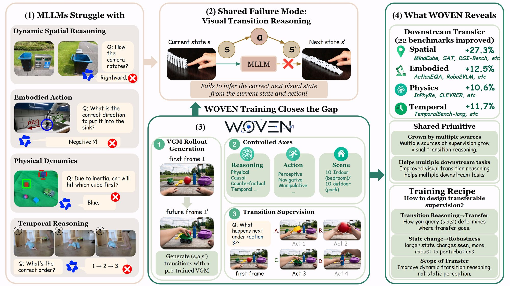
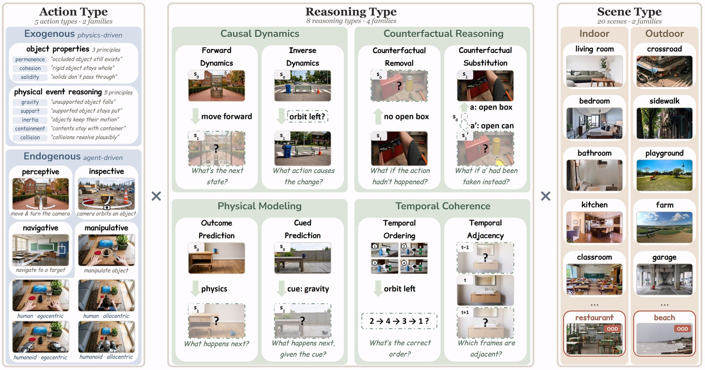

<p align="center">
  
</p>

<h3 align="center">Weaving Visual World Modeling into Multimodal LLMs</h3>

<p align="center">
  <a href="https://arxiv.org/abs/2610.12417"></a>
  <a href="https://woven-ai.github.io"></a>
  <a href="https://huggingface.co/datasets/MLL-Lab/WOVEN"></a>
  <a href="LICENSE"></a>
</p>

<p align="center">
  <b>Zheyu Fan</b>, Yue Zhang, Mingkai Deng, Kangrui Wang, Qineng Wang, Canyu Chen,<br>
  Jie Hao, Xing Fan, Chenlei Guo, Eric P. Xing, Mohit Bansal, Manling Li
</p>

<p align="center">
  
</p>

**WOVEN** is a training source and benchmark for **visual transition reasoning**: given a transition (s, a, s′), infer its unobserved part from the observed parts. It contains **36,076** four-option multiple-choice items across **20 scene types**, **5 action types**, and **8 reasoning types**, built from rollouts of a video generation model. Training subsets of only about 2,000 WOVEN items each collectively improve **22 of 26** external benchmarks, by up to **27.3** percentage points.

This repository contains the code to **train** multimodal LLMs on WOVEN with SFT and GRPO. The evaluation code for WOVEN and the 26 external benchmarks is coming soon.

## 📰 News

- **2026-10-09** — Training code released. The WOVEN training split is available on [Hugging Face](https://huggingface.co/datasets/MLL-Lab/WOVEN); the validation split and the test sets are coming soon.

## 📑 Contents

- [Installation](#-installation)
- [Data](#-data)
- [Training](#-training)
- [Evaluation](#-evaluation)
- [Repository layout](#-repository-layout)
- [Citation](#-citation)

## 🔧 Installation

We use two conda environments: `woven_sft` for supervised fine-tuning and `woven_rl` for GRPO (verl + vLLM). Tested with CUDA 12.x on NVIDIA A100/H100 GPUs.

```bash
git clone https://github.com/mll-lab-nu/WOVEN.git
cd WOVEN
bash requirements/setup_envs.sh          # creates woven_sft and woven_rl
```

SFT builds on the official Qwen2.5-VL fine-tuning code. Clone it at the pinned commit and apply our data patch:

```bash
git clone https://github.com/QwenLM/Qwen2.5-VL.git third_party/Qwen2.5-VL
git -C third_party/Qwen2.5-VL checkout $(cat training/sft/qwenvl_patch/UPSTREAM_COMMIT)
bash training/sft/apply_patch.sh third_party/Qwen2.5-VL
```

The base model (`Qwen/Qwen2.5-VL-3B-Instruct` by default) is fetched from the Hugging Face Hub on first use; set `MODEL_PATH` to use a local copy.

## 📦 Data

<p align="center">
  
</p>

The data is hosted at [`MLL-Lab/WOVEN`](https://huggingface.co/datasets/MLL-Lab/WOVEN). Each item stores its images inside the row, so no separate image download is needed:

```python
from datasets import load_dataset

ds = load_dataset("MLL-Lab/WOVEN", data_files="train/questions-*.parquet", split="train")
ex = ds[0]
print(ex["reasoning_type"], ex["action_type"], ex["scene"])
print(ex["question"])        # images are referenced as <image_1>, <image_2>, ...
print(ex["answer"])
```

| Reasoning family | Reasoning types | Action types |
|---|---|---|
| Causal dynamics | forward dynamics, inverse dynamics | passive physical events (8 principles) |
| Counterfactual reasoning | counterfactual removal, counterfactual substitution | camera motion |
| Physical modeling | outcome prediction, cued prediction | object inspection |
| Temporal coherence | temporal ordering, temporal adjacency | navigation, object manipulation |

## 🚀 Training

### 1. Prepare SFT data

`prepare_data.py` downloads the split from the Hub (or reads local files with `--local-parquet`), writes the images to disk, and renders each item into the prompt format used in the paper. `--permute 4` presents every item under four option orders (the option-permutation augmentation); `--action-types` and `--reasoning-types` select a controlled subset.

```bash
conda activate woven_sft
python training/prepare_data.py --split train --out data/sft/full --permute 4

# a controlled subset, e.g. camera motion x causal dynamics
python training/prepare_data.py --split train --out data/sft/perc_causal --permute 4 \
    --action-types perceptive --reasoning-types forward_dynamics inverse_dynamics
```

### 2. Supervised fine-tuning (LoRA)

```bash
QWENVL_REPO=third_party/Qwen2.5-VL/qwen-vl-finetune \
TRAIN_JSON=data/sft/full/train.json \
RUN_NAME=woven_sft \
bash training/sft/train_sft.sh
```

LoRA (rank 16) on the language model's q/k/v/o projections, 3 epochs, learning rate 1e-4 with cosine decay. Merge the adapter before GRPO:

```bash
python training/sft/merge_lora.py outputs/sft/woven_sft outputs/merged/woven_sft
```

### 3. GRPO

```bash
conda activate woven_rl
python training/prepare_data.py --split train --out data/rl/full --format verl
INIT_MODEL=outputs/merged/woven_sft PARQUET=data/rl/full/train.parquet RUN_NAME=woven_grpo \
bash training/grpo/train_grpo.sh
```

GRPO runs with [verl](https://github.com/volcengine/verl) and vLLM. The reward combines answer correctness with a penalty on answer-letter imbalance (`training/grpo/reward.py`).

## 📊 Evaluation

Evaluation code for the WOVEN test sets (local and API models) and for the 26 external benchmarks is coming soon.

## 🗂 Repository layout

```
WOVEN/
├── training/
│   ├── prepare_data.py        # HF dataset -> SFT JSON / GRPO parquet, option permutation, subsets
│   ├── sft/                   # LoRA SFT launcher, Qwen2.5-VL fine-tuning patch, LoRA merge
│   └── grpo/                  # verl GRPO launcher and reward
├── requirements/              # pinned environments
└── assets/
```

## 📝 Citation

```bibtex
@article{fan2026woven,
  title={WOVEN: Weaving Visual World Modeling into Multimodal LLMs},
  author={Fan, Zheyu and Zhang, Yue and Deng, Mingkai and Wang, Kangrui and Wang, Qineng and Chen, Canyu and Hao, Jie and Fan, Xing and Guo, Chenlei and Xing, Eric P. and Bansal, Mohit and Li, Manling},
  journal={arXiv preprint arXiv:2610.12417},
  year={2026}
}
```

## 🙏 Acknowledgements

This code builds on [Qwen2.5-VL](https://github.com/QwenLM/Qwen2.5-VL), [verl](https://github.com/volcengine/verl), and [vLLM](https://github.com/vllm-project/vllm).
